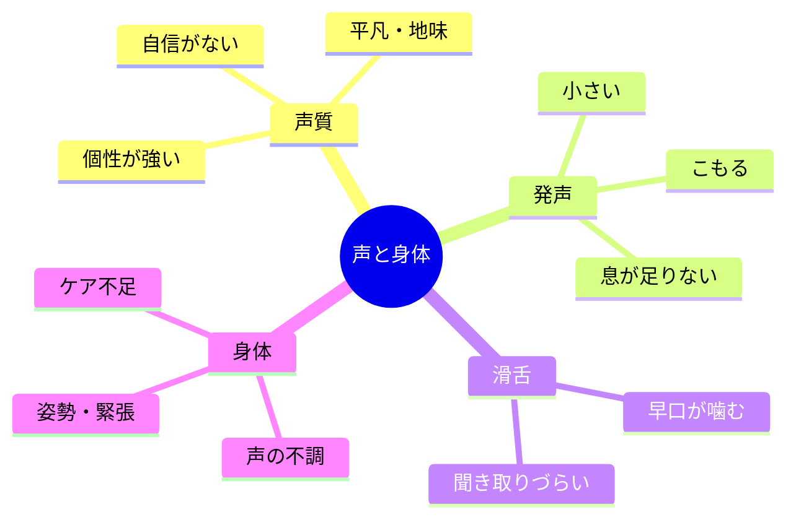

# 01｜声と身体表現

## マインドマップ（コンパクト）

## 補足（図に載せきれないこと）

- 「この声では無理」は先入れになりがち。役柄によっては強みになることもある。
- 滑舌・音量・息はボイストレでかなり触れる領域。
- 喉を痛めない休息・加湿・発声前の準備は長期戦の土台。

## 掘り下げ

### 声質（地声・キャラ声・「平凡」への不安）

- **地声が地味**と感じるとき、多くは「話す声」と「演技としての声」の区別がまだ薄い段階。キャラ声は声帯の使い方・共鳴・口形の設計で幅が出る。
- **平凡＝不利**ではない。ナレーション・脇役・実在寄りの演技では「記憶に残りすぎない声」が武器になることもある。
- **個性が強い声**は、キャスティングの両刃。尖りは「型」に落とすと仕事の幅が広がりやすい（いつも同じキャラに見える、を避ける）。
- 自分の声の客観データは、スマホ録音より**マイク＋ヘッドホン監視**に近い環境のほうがブレが少ない（部屋の反響・マイク距離に注意）。

### 発声（小さい・こもる・息が足りない）

- **音量**は「叫ぶ」より**息の通り道・共鳴の最適化**で伸びることが多い。無理に喉で押すとすぐ上限が来る。
- **こもる**原因は一つではない（低すぎるマイク位置、口の開き、鼻に逃がす癖、緊張による喉の固定など）。原因の切り分けは指導者がいると早い。
- **息が足りない**は体力だけでなく、**文節での換気設計**や**無駄な喉の力**が原因のこともある。
- 「腹式呼吸ができれば全部解決」は過大評価されがち。**肋骨・背中・舌の解放**まで含めた全身の話になりやすい。

### 滑舌（噛む・聞き取りづらい）

- **早口**は舌の筋肉というより、**予備動作が小さい／顎が固い／拍が不安定**で崩れることが多い。
- **連続失敗**が続くなら、台本の問題ではなく**基本の母音行（あいうえお）→短文→長文**の階段で戻るのが効くことが多い。
- 方言や話し言葉の癖は、**標準的な収録用の土台**を別に作っておくと安心（「消す」より「切り替える」イメージ）。

### 身体・ケア（不調・姿勢・緊張）

- **声の不調**が続くときは、我慢より優先度高め。長引く痛み・嗄れ・話しにくさは医療機関の判断が必要な場合がある（自己診断で完結させない）。
- **睡眠・水分・湿度・カフェイン・胃酸逆流**は地味だが効く。収録前日の徹夜はリカバリコストが高い。
- **首肩のこり**は声の自由を奪う。PC作業やスマホ姿勢とセットで見る価値がある。
- 緊張で身体が硬いときは、大げさなリラックスより**「収録で許容される緊張の量」**を自分の中で定義すると楽になることがある。

### 練習の切り方（迷ったら）

1. 録って聴く（毎回同じ条件で）
2. 一つだけ変える（マイク距離／口の開き／速度など）
3. 第三者の耳を月1回でも入れる（独りよがりの早期脱却）
