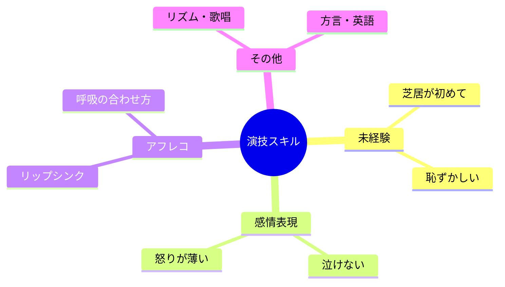

# 02｜演技とスキル

## マインドマップ（コンパクト）

## 補足

- 声優の「演技」は段階を踏むと学びやすい（テキスト読み→状況想像→身体でやる）。
- アフレコは経験を積むほど「見て合わせる」感覚が身につきやすい。
- 歌唱・英語は求められる作品次第で優先度が変わる。

## 掘り下げ

### 未経験・恥ずかしさ

- 最初から「感情を出す」より、**事実を伝える**→**状況を具体化する**→**相手がいる前提**の順が負担が少ないことが多い。
- 恥は**自己監視が高いほど強くなる**。鏡・録画は適量。最初は音だけのほうが演技が入りやすい人もいる。
- 観察学習はアニメだけでなく、**ドキュメンタリー・インタビュー・スポーツ実況**など「声のプロ」全般から盗むと筋が良い。

### 感情表現（泣けない・怒りが薄い）

- **泣く／怒る**は才能というより、多くは**呼吸・拍・文の意図**の設計問題として分解できる。
- 「自分の体験に引きずられる」方式は強いが、燃えやすい。**状況と目的から逆算**する技術系のやり方も並行すると安定する。
- 感情が薄く聞こえる典型は、(1)意味が頭で追えていない、(2)声だけ上げて身体が止まる、(3)文章を単語の積み上げで読んでいる、のどれか。

### アフレコ（リップシンク・呼吸）

- 映像に合わせるのは「目で追う」より先に、**拍の頭**と**口の運びの予測**が効いてくる。同じカットをループ練習は王道。
- **息**は演技の一部。息が荒い／息が無いは、キャラの状態設計とセットで決めるとブレない。
- **キップ（テイクの区切り）**や「3回前」など現場用語は早めに慣れると焦りが減る（教材・ワークショップで触れる）。

### 歌唱・リズム

- 声優案件の歌は「歌手級」より**役として歌える**が要求されることが多い。音程より先に**歌詞の意味の線**を通す練習が効く場面もある。
- リズム台詞はメトロノームより、**身体で拍を取る**ほうが現場向きのことが多い。

### 方言・英語

- 方言は「再現」より**担当者が求める輪郭**（どこまで崩すか）が重要。勝手に極端にしがち。
- 英語は作品ジャンル次第。伸ばすなら**音とリズムの型**（辞書より耳朵）を優先しがちで現実的。

### 伸ばし方の優先順位（例）

1. 台本を誤読なく読める（意味・拍・換気）
2. 相手／状況が頭に立つ（独り言でも）
3. 収録の作法（マイク・テイク・修正の受け方）
4. キャラ声の設計（幅を増やす）
5. 特殊スキル（歌・英語・方言など、狙いに合わせる）
