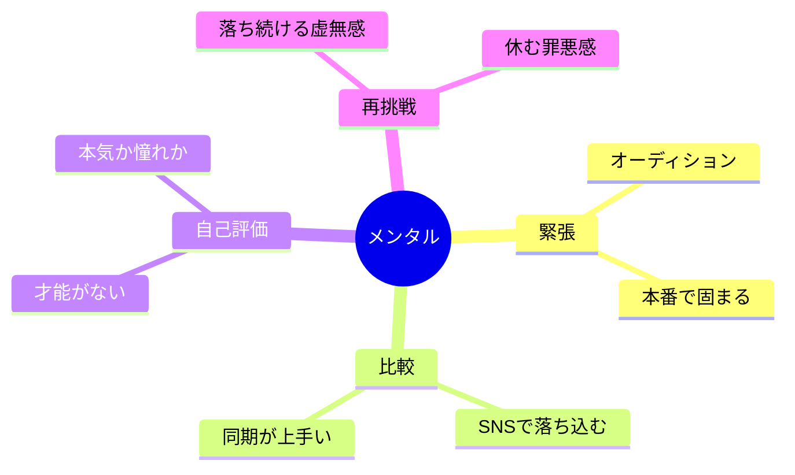

# 03｜心理とメンタル

## マインドマップ（コンパクト）

## 補足

- 緊張は「ゼロ」より「扱える量」にする発想のほうが現実的なことが多い。
- 比較は情報過多のときほどキツくなりやすい。入力源の整理も対策になりうる。
- 「本気」の定義を言語化できると、迷いが減りやすい。

## 掘り下げ

### 緊張・オーディションで固まる

- 緊張は**敵ではなく覚醒の信号**として扱うと壊れにくい。消すより「声・呼吸・視線のルーティン」に変換する。
- オーディションは結果が読めないほど、**コントロール可能域（準備・睡眠・当日の手順）**に意識を置くほどメンタルが守られる。
- 固まる典型は「評価されている意識が強すぎる」。**相手に届ける／役を守る**に目的をずらすと身体が動きやすい。

### 比較（SNS・同期）

- SNSは**生存者バイアス**が強い。伸びている人の表面だけが見え、練習量・環境・タイミングが見えない。
- 同期が上手いのは脅威であると同時に、**近いレベルの鏡**にもなる。距離感（距離を取る／仲良くする）は自分の回復速度優先で決める。

### 自己評価（才能がない／本気か憧れか）

- 「才能」は観測しにくい。**再現性のある技能**（読解、呼吸、収録作法、Type別の演技の型）に言い換えると改善ループが回る。
- 憧れと本気の切り分けは、短時間で決めなくていい。**週あたりの行動量・継続月数・生活コスト**で見ると現実と折り合いが付きやすい。
- 「好き」だけだと燃えるが、「生活設計」まで含めると重くなる。その重さを**一人で抱えない**（相談窓口・仲間・専門家）のも立派な戦略。

### 落ち続ける・休む罪悪感

- 不合格は**個人の価値の判定**ではなく、キャスティングの合否が多い。とはいえ辛いのは当然なので、**感情を処理する時間**を予定に入れるのは合理的。
- 休みは堕落ではなく**声と心の保守点検**。休むと不安が増えるタイプは、「休みの目的（回復項目）」を一行書いてから休むと楽。

### 早めに相談したいサイン（目安）

- 睡眠・食欲の急変が続く
- 活動ができないのに休めない
- 自己否定が一日の大半を占める

このあたりは、信頼できる大人・カウンセリング等の外部支援を検討する余地が大きい。
