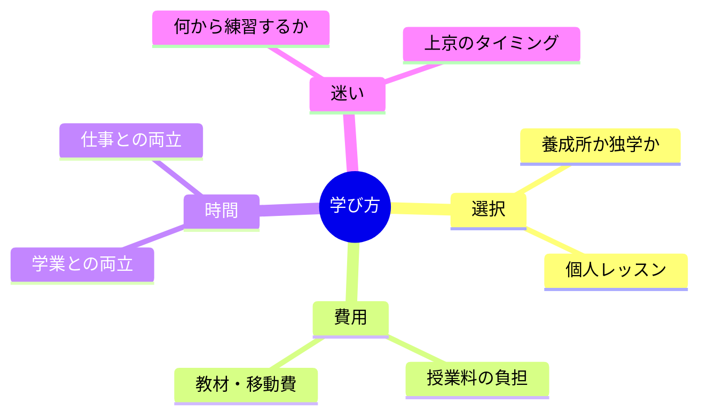

# 04｜ルートと学び方

## マインドマップ（コンパクト）

## 補足

- ルートは正解が一つではなく、今の立地・資金・期限で「試せる幅」が変わる。
- 「何から」は目的別（滑舌／演技／収録体験など）に3ヶ月単位で切ると動きやすい。
- 上京はチャンスと生活コストのトレードオフ。情報収集と試算が有効。

## 掘り下げ

### 養成所・スクール・独学の整理

- **養成所／スクール**の価値はカリキュラムだけでなく、**同世代・講師・機材・発表機会・業界接続の密度**に出やすい。費用はその「密度の対価」として見積もると腹落ちしやすい。
- **独学**でも成立はするが、ボイスだけは自己流が伸びにくい。**月1でも第三者フィードバック**があると曲がり角が早い。
- **個人レッスン**は狙い撃ちに強い（滑舌だけ、英語だけなど）。養成所と併用する人もいる。

### 費用（授業料以外も含めて）

- 交通費、教材、録音環境（安価でも）、オーディション交通費、衣装・宣材など、**見えにくいコスト**を一覧にすると親との対話や自己判断が楽になる。
- 「払えばなる」ではないので、**支払い後の週次行動**（練習時間・提出物・発表回数）までセットで契約イメージを持つと後悔が減りやすい。

### 時間の両立（学業・仕事）

- 両立は「毎日同じ量」より**週の総量と回復**が重要。詰めて壊れると長期で損する。
- 学校／会社に隠す必要がストレスなら、**言う範囲・言わない範囲**を決める（全開示が正解とは限らない）。

### 「何から練習？」の答え方

- まず目的を一つに絞る例：**滑舌**／**台本の初速**／**キャラ2タイプ**／**収録マナー体験**など。
- 3ヶ月で「終わりが見える課題」にすると継続率が上がる（例：指定台詞を毎週録り、月末に比較）。

### 上京のタイミング

- 上京は**チャンス密度**が上がりやすい一方、**生活コストと精神的余白**を削る。地元で土台（生活費・心身・基礎技能）を作ってから、という順序も合理的。
- 判断材料の例：通学時間、バイト可能時間、住居の安定、緊急時の帰省コスト、医療アクセス。

### 自己チェック（ルート見直し用）

- お金は理由になっているが、本当は怖さが主因ではないか
- 環境が悪いのか、目標の粒度が粗いのか
- 「情報収集」が練習の代替になっていないか
