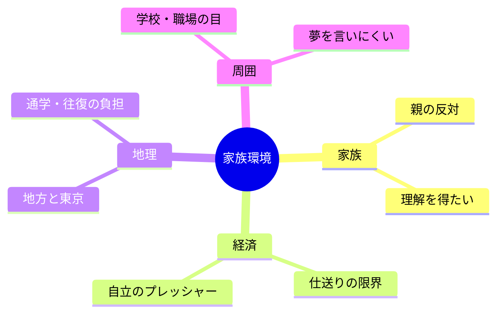

# 05｜家族と環境

## マインドマップ（コンパクト）

## 補足

- 反対は「不安の翻訳」であることが多い。リスクと対策をセットで話すと対話しやすい。
- 地理はオンライン活用で一部緩和できるが、現場参加の機会は地域差が出やすい。
- 周囲の反応より、自分の継続条件（時間・金・健康）を先に固めると迷いが減る。

## 掘り下げ

### 親の反対・理解

- 反対の中身はだいたい**(1)経済、(2)安定、(3)情報不足、(4)心配の言い方**のブレンド。全部を一度で解決しようとしないほうが会話が続きやすい。
- 伝わりやすいのは「夢」より**計画**：週の練習量、費用の上限、成績／仕事との境界、撤退基準（例：○年で△の状態なら方針見直し）など。
- 理解＝全面同意ではない。**不同意でも協力してもらえる線**（送迎、機材、時間の確保）を探すのも手。

### 経済（仕送り・自立）

- 「夢のために借金」は最後の手段に近い。**返済シミュレーション**を数字で見る（本人だけでなく家族も）。
- 仕送りが難しいなら、**期間限定の投資**（例：半年だけレッスン）に縮める、オンライン中心にする、などへ要件を下げるのは敗北ではなく設計。

### 地理（地方と東京・通学負担）

- オンラインで基礎は伸ばしやすいが、**現場の空気・立ち振る舞い・即応**は対面で初めて分かることがある。頻度は人による。
- 通学負担が心身に出るなら、**週回数を減らして宿題密度を上げる**など、形を変えて総負荷を下げる選択肢がある。

### 周囲の目（学校・職場）

- 夢を言うと揶揄られる環境では、**黙って積む**のも合理的。ただし孤立しすぎるとメンタルが危ないので、**安全な相談先は最低一つ**確保したい。
- 職場では本音全開が逆効果なこともある。**守れる範囲の自己開示**で十分な場合が多い。

### 対話の準備（そのまま使えるメモ例）

- 自分が取りたい路線（アニメ中心か、ナレ多めか等）を一言で言える
- 月の予算上限と、その内訳の仮説
- 体調・学業・睡眠を落とさないためのルール
- 「やめる／縮小する」条件を自分の中で先に決めておく（怖さ対策になる）
