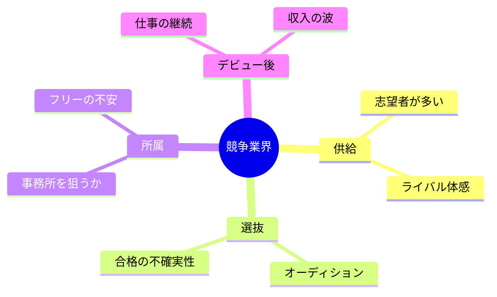

# 06｜競争と業界

## マインドマップ（コンパクト）

## 補足

- 「宝くじ感」は統計と向き合うほど説明しやすいが、同時に個人の努力で動く範囲もある。
- 所属はメリット／デメリットがセット。自分の性格と相性も判断材料になりうる。
- デビュー後は営業・人間関係・スキルの幅が効いてくる場面が増えがち。

## 掘り下げ

### 供給過多・ライバル体感

- 母数が大きいほど、**偶然当たる期待**は上がりにくい。だからこそ、志望者側は**再現性（技能・素材・判断力）**に寄せたほうが精神が安定しやすい。
- ライバルは「全員」ではなく、**同じオーディションの同じ役の数十人**くらいのイメージのほうが行動が現実的になりやすい。

### オーディション・選抜の不確実性

- 合否は実力だけでは説明しきれない要素が混ざる。**一次で落ちるのを個人の全面否定に結びつけない**工夫が要る（難しいが重要）。
- 受かりやすくするより先に、**受け続けられる生活設計**（交通、睡眠、金、心）のほうが長期戦では効くことが多い。

### 事務所所属 vs フリー（不安の中身）

- **所属**のメリット例：案件の入口、事務連絡、信用の補助、育成の導線。デメリット例：裁量の制約、相性リスク、契約の理解が必要。
- **フリー**のメリット例：自由度。デメリット例：営業・交渉・事務の自己責任が増える。
- 「どちらが正しい」より、**今の自分が回せるオペレーション量**で選ぶとミスマッチが減りやすい。

### デビュー後（仕事の継続・収入の波）

- デビューはスタート地点に近い。**リピート要因**（信頼、準備の速さ、現場での扱いやすさ、スキルの幅）がじわじわ効く。
- 収入の波は、生活設計で吸収できるかが鍵。**固定費を下げる／別収入の可否／貯蓄**は地味だが効く。

### 情報の取り方（迷子防止）

- 噂話と構造理解は分ける（炎上より、**制作フロー**や**クレジットの読み方**のほうが学びになることが多い）。
- 先輩の体験談は宝だが、**時代と個人差**がある。サンプル数を増やすほど一般化しやすい。

### 自分用の「現実チェック」質問例

- 今のスキルは、**未経験の第三者**に聴かせて説明できるか
- オーディションに落ちたとき、**次の行動**が決まっているか
- 体調を崩さず、**同じ強度を半年続けられるか**
