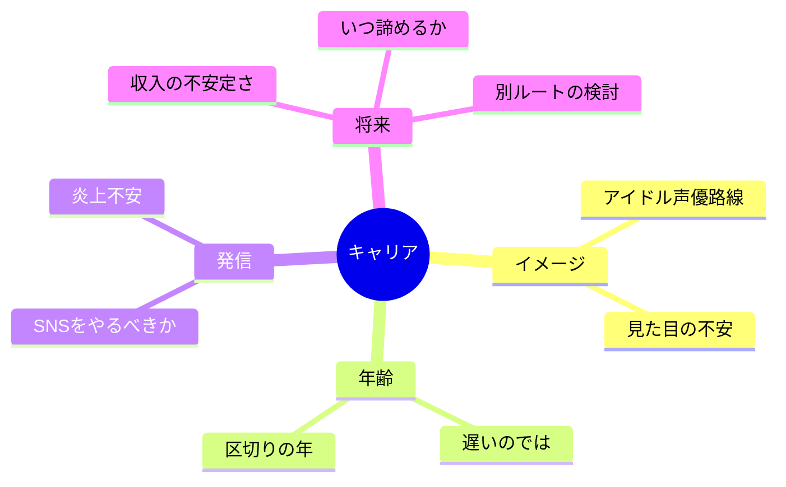

# 07｜キャリアとプレッシャー

## マインドマップ（コンパクト）

## 補足

- 「見た目」は作品・路線によって重みが変わる。自分が取りたい仕事の実例で観察するとブレにくい。
- 年齢は絶対条件ではないが、生活設計との両立は早めにシミュレーションしたい。
- SNSは必須ではないが、使うならルール（距離・更新頻度・心の守り方）を決めると安全。

## 掘り下げ

### アイドル声優イメージ・見た目の不安

- 市場には多様な需要がある。**写真の宣材が最重視される路線**と、そうでない路線は混ざる。自分が取りたい仕事の実例（クレジット・イベント出演頻度等）で観察すると幻想が減る。
- 見た目の不安が強いとき、根っこは**自己価値の単線化**（声以外がゼロ点に見える）になっていることがある。対策は「技能の複線化」。

### 年齢・区切りの年

- 「遅い」は相対評価。**生活の安全網**とセットで考えると、遅さの怖さが処理しやすい。
- 区切りの年は外圧になりやすい。本人の中では、**撤退・縮小・方向転換**を「失敗」ではなく**設計の更新**と呼ぶと続けやすい。

### SNS（やるべきか・炎上不安）

- SNSは必須ではない。必要なのは案件次第で、**仕事の入口がSNSに寄るタイプ**と寄らないタイプがある。
- やるなら最低限：**個人情報の境界**、**論争に乗らない**、**疲れたら止める仕組み**（通知オフ、別アカウント、更新頻度の上限）。
- 炎上不安が強いなら、最初から「発信しない選択」も立派。代わりに**音源ポートフォリオ**や**現場評価**側に寄せる戦略もある。

### 収入の不安定さ

- フリーランス的な波は、**現金のバッファ（何ヶ月分）**で不安が変わる。精神論より会計の話。
- 副業・別職は「逃げ」ではなく、**長く続けるためのインフラ**になりうる。

### いつ諦めるか・別ルート

- 諦めは一瞬で決めなくていい。**縮小（週回数・目標の幅・居住）**のほうが現実的なことが多い。
- 別ルート（音響、演出補助、配信運営、教育など）は敗北ではなく、**スキルの再利用**。後から戻る人もいる。

### プレッシャーを分解するフレーム（例）

| 圧力の正体 | 例 | いじれるレバー |
|-----------|----|----------------|
| 外圧 | 親、世間のイメージ | 説明資料、距離、開示範囲 |
| 内圧 | 完璧主義 | 課題の粒度、第三者レビュー |
| 市場圧 | 競争、トレンド | ニッチの明確化、素材の更新 |
| 生活圧 | 金・時間 | 固定費、スケジュール、回復 |

全部を同時に解こうとせず、**一列だけ直す**と前に進みやすい。
