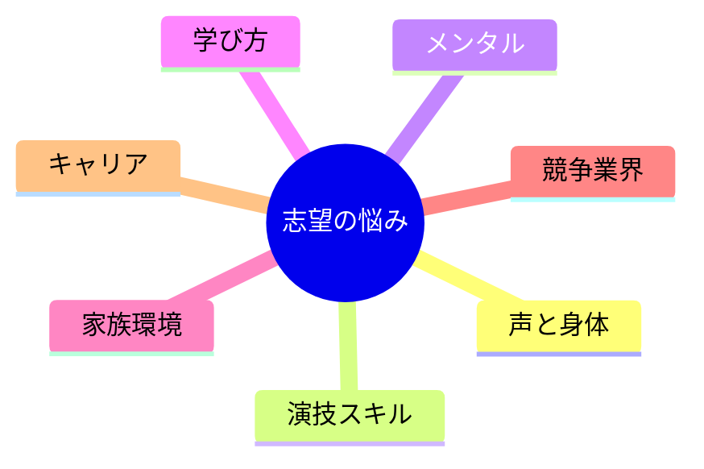

# 声優志望者の悩みマップ（分割版）

1枚の Mermaid で全部載せるとノードが重なりやすいので、**カテゴリ別 `.md`** に分けています。

| # | ファイル | 内容 |
|---|----------|------|
| 1 | [01_声と身体表現.md](./01_声と身体表現.md) | 声質・発声・身体 |
| 2 | [02_演技とスキル.md](./02_演技とスキル.md) | 演技・アフレコ・言語 |
| 3 | [03_心理とメンタル.md](./03_心理とメンタル.md) | 緊張・比較・本気度 |
| 4 | [04_ルートと学び方.md](./04_ルートと学び方.md) | 養成所・練習・上京 |
| 5 | [05_家族と環境.md](./05_家族と環境.md) | 親・経済・地方 |
| 6 | [06_競争と業界.md](./06_競争と業界.md) | オーディション・所属 |
| 7 | [07_キャリアとプレッシャー.md](./07_キャリアとプレッシャー.md) | 収入・年齢・SNS |

各ファイルの末尾に **「掘り下げ」**（小見出し＋箇条書き）を付けています。図はコンパクトのまま、本文で枝を広げる構成です。

## 全体の鳥瞰（ノード少なめ）

必要な枝だけ開いて使う想定です。
